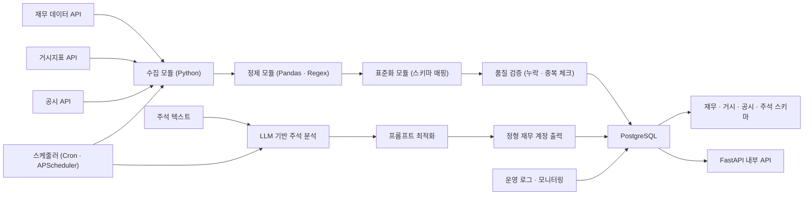
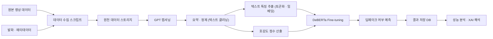
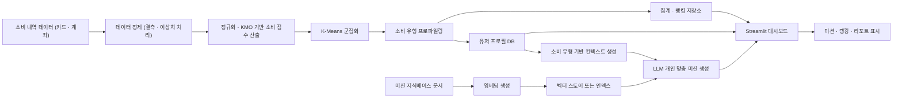
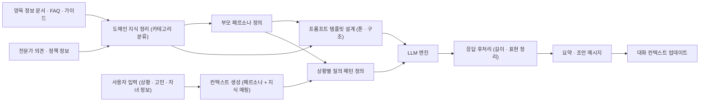

# 👋 About Me
데이터가 안정적으로 흐르는 구조를 설계하는 데이터 엔지니어이자  
LLM 기반 데이터 처리 및 RAG 서비스 구축 경험을 보유한 AI 엔지니어입니다.

정확성, 일관성, 자동화를 중심으로  
대규모 이기종 데이터 처리, 파이프라인 구축, 비정형 데이터 정형화, LLM 연동 시스템을 직접 설계하고 운영해왔습니다.

---

# 🛠 Skills

**Data Engineering**
- Python (Pandas, NumPy)        ██████████░░  (80%)
- SQL (PostgreSQL)              ████████░░░░  (70%)
- ETL / 파이프라인 자동화       ████████░░░░  (70%)
- 데이터 모델링 · 표준화         ███████░░░░░  (60%)
- FastAPI 기반 API 구축         ███████░░░░░  (60%)

**AI / LLM**
- LLM Prompt Engineering        █████████░░░  (75%)
- 비정형 텍스트 정형화 파이프라인 ████████░░░░ (70%)
- RAG 구조 설계                 ███████░░░░░  (60%)
- NLP 전처리                    ████████░░░░  (70%)

**Infra / 협업**
- Git                          ████████░░░░  (70%)
- Docker                       ██████░░░░░░  (50%)
- GCP 실험 환경 사용           ██████░░░░░░  (50%)

---

# 📂 Projects

## 1. AI 경제기사 데이터 파이프라인 구축 (2025.03 ~ 진행 중)
**역할:** 데이터 엔지니어  
**기술:** Python, FastAPI, PostgreSQL, LLM  

### 문제
기업별 주석 구조 상이, 비정형 데이터 자동 처리 어려움  
재무 변수 누락 및 표준화 불가

### 해결
- 재무·거시·공시·주석 데이터 자동 수집 ETL 설계  
- PostgreSQL 기반 데이터 모델링 및 적재 구조 구축  
- LLM 기반 주석 정형화 시스템 개발  
- 프롬프트 최적화로 누락률 40% → 8% 감소  
- 운영 자동화 및 검증 로직 구현

### 성과
- 주석 기반 재무정보 추출 정확도 90%대  
- 파이프라인 자동 운영 성공률 99% 이상  
- 이기종 대규모 데이터 표준화·품질관리 역량 확보

---

## 2. 텍스트 기반 딥페이크 탐지 파이프라인 (2025.07 ~ 2025.09)
**역할:** 데이터 처리 및 실험 파이프라인 설계  
**기술:** Python, PyTorch, NLP, GCP

### 문제
영상 기반 탐지는 설명력 부족 및 생성 모델 변화에 취약

### 해결
- 영상 → 텍스트 변환 파이프라인 구축(GPT 캡션 생성)
- 텍스트 신호 기반 멀티모달 특징 추출 구조 설계
- Fine-tuning 실험 환경을 GCP에서 체계적으로 운영

### 성과
- 탐지 성능 37% 개선  
- 멀티모달 데이터 처리 및 실험 자동화 경험 확보

---

## 3. 소비점수 기반 저축 게임화 플랫폼 (2025.11 ~ 2025.12)
**역할:** 데이터 엔지니어·AI 기능 설계  
**기술:** Python, Scikit-learn, RAG, LLM, Streamlit

### 문제
금융 앱의 개인화 기능 부족

### 해결
- 소비 데이터 정제·정규화·점수화 파이프라인 구축
- K-Means 기반 사용자 유형화
- RAG 기반 개인화 미션 자동 생성 시스템 설계

### 성과
- 사용자 유형 4개 도출  
- 개인화 미션 자동 생성 기능 구현  
- 분석 로직을 서비스 기능으로 연결하는 구조 설계 경험 확보

---

## 4. 굿페런츠 LLM 도우미 (2025.11)
**역할:** 프롬프트 아키텍처 설계  
**기술:** LLM Prompt Engineering

### 문제
양육 정보 과다, 비일관성으로 의사결정 어려움

### 해결
- 사용자 페르소나 기반 정보 구조 정의
- 일관된 조언·요약을 생성하는 프롬프트 규칙 설계

### 성과
- 프로토타입 완성  
- LLM 기반 서비스 문맥 구조 설계 경험 확보

---

# 📊 Data Architecture 

### 1. AI 경제기사 데이터 파이프라인

### 2. 캡션/호감도 기반 텍스트 딥페이크 탐지 파이프라인

### 3. 소비점수 기반 저축 게임화 플랫폼 데이터 아키텍처

### 4. 굿페런츠 AI 도우미 아키텍처

---

# 🌟 Key Achievements
- 이기종 재무 데이터 자동 수집·정제·적재 파이프라인 구축
- LLM 기반 비정형 데이터 정형화로 누락률 40%에서 8%로 개선
- 자동화 파이프라인 운영 성공률 99% 이상
- RAG 기반 개인화 서비스 구조 설계
- FastAPI 기반 사내 API 구축 및 운영
- 대규모 텍스트·주석 데이터 처리 경험 다수

---

# 🧩 What I Can Contribute
- 데이터 표준화 및 품질 중심 파이프라인 구축
- LLM·RAG 기반 서비스 기능 설계 및 데이터 흐름 구성
- 안정적 운영을 위한 구조적 문제 해결 및 검증 로직 설계
- 다양한 팀과 협업하며 기술 요구사항을 구조화하고 구현 가능한 형태로 재정의하는 역량

---

# 📬 Contact
Email: pdchf110872@gmail.com
